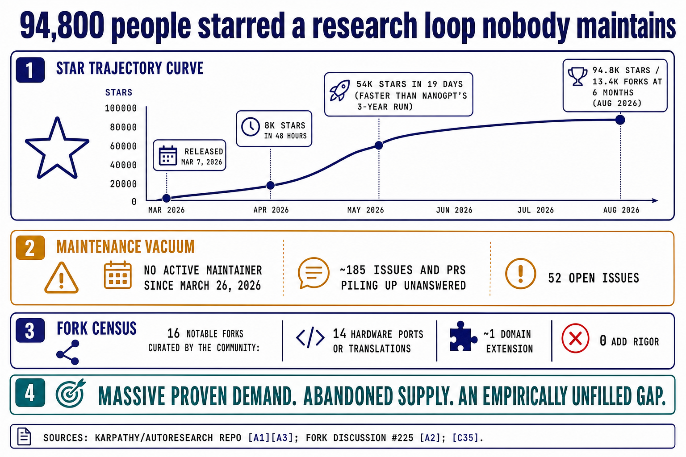
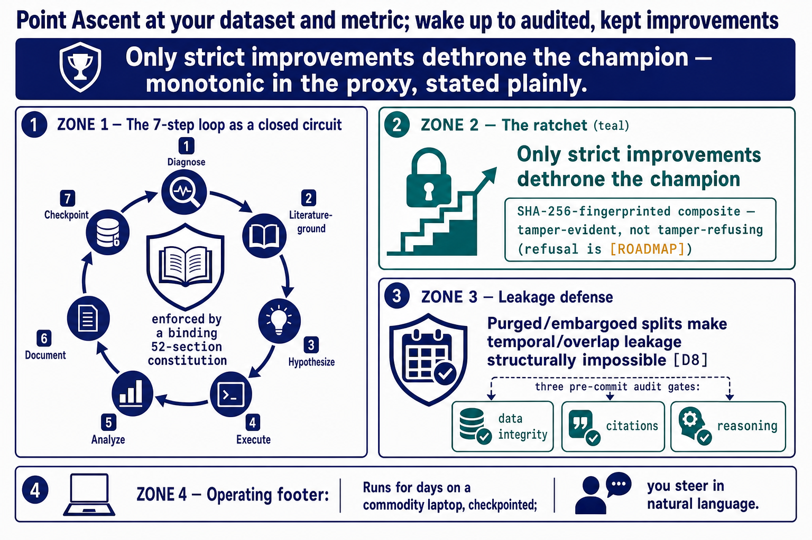
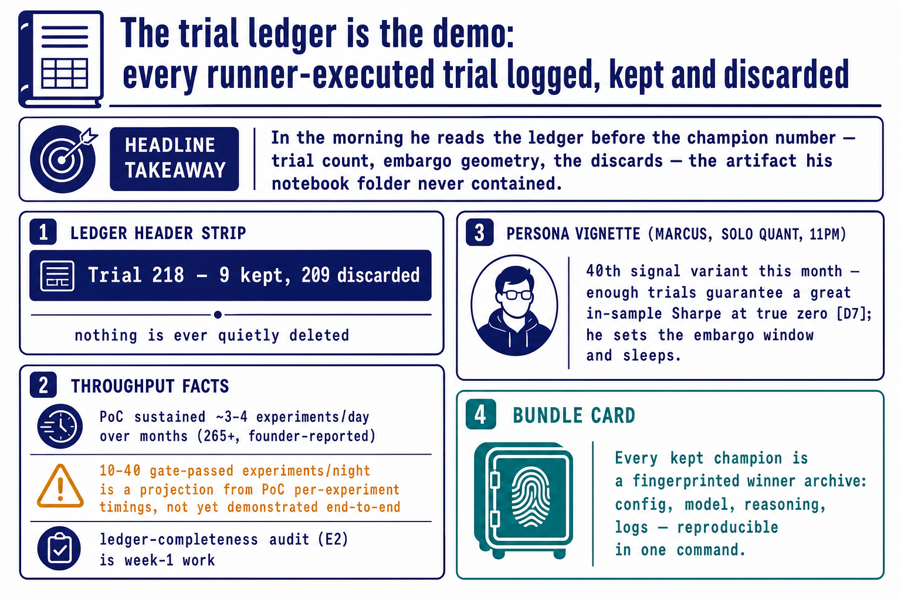
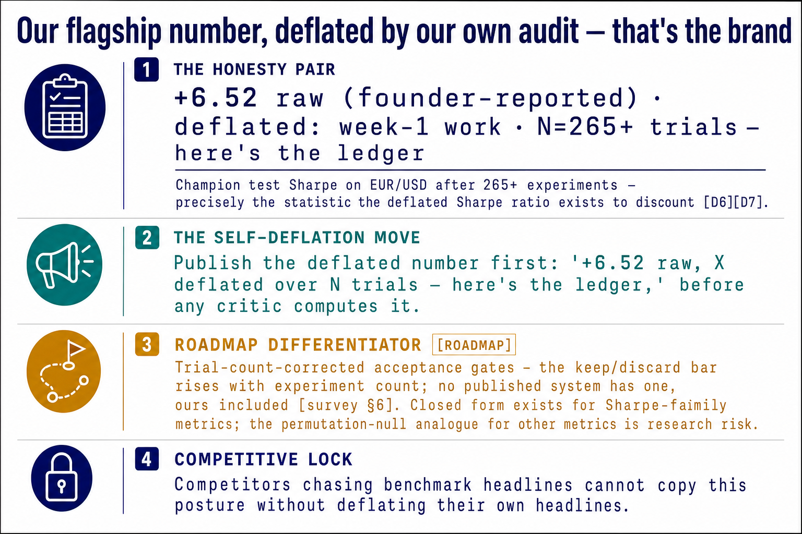

# Ascent — the autonomous ML research operating system

**Point it at any dataset and metric, and it hill-climbs monotonically toward state-of-the-art — every experiment literature-grounded, audit-gated, and reproducible — running for days on a commodity laptop.**

Rigorous ML experimentation is policed by nothing but human discipline, and discipline fails at published scale: data leakage is documented in at least 294 papers across 17 fields, while the automated alternatives fail the other way — the most famous AI-scientist system had 42% of its experiments fail on coding errors under independent evaluation. Ascent puts a binding, open-source **constitution** between the practitioner and the metric: a 7-step scientific method on every experiment, three programmatic pre-commit audit gates, purged/embargoed splits that make leakage structurally impossible, and a SHA-256-fingerprinted composite metric that makes keep-or-discard **tamper-evident**. You steer in natural language. The protocol supplies the judgment a tired human skips.

---

**Live site:** **https://dlmastery.github.io/startup-skills/runs/autoresearch/**
**Run:** `autoresearch` · **Generated:** 2026-08-28 · **Status: PARTIAL**
**52 of 53 required artifacts present · 21 of 100 visuals rendered · 10 of 78 required HTML infographics**
The text pack is complete and cross-layer reconciled. The visual layer is 21% rendered. See [What's missing](#whats-missing--next-draw) — nothing here is hidden.

---

## Start here — 60 seconds

1. **[`narrative/one_pager.md`](narrative/one_pager.md)** — the whole company on one page, every number tagged to a source.
2. **[`narrative/pitch_deck.md`](narrative/pitch_deck.md)** — 15 slides, each with its visual ID.
3. **[`tech/whitepaper.md`](tech/whitepaper.md)** — why this is 10x, defended as arithmetic: 5.1× more valid output × 6× cheaper days ÷ 3 honesty discount = 10.4×.

## The pack at a glance

## Reading paths by audience

**Investor** — the diligence order, sharpest objection first.
1. [`narrative/one_pager.md`](narrative/one_pager.md) — the claim.
2. [`narrative/vc_memo.md`](narrative/vc_memo.md) — the technical memo written for a skeptic.
3. [`strategy/market_sizing.md`](strategy/market_sizing.md) — $2–3B job-filtered core TAM, bottom-up; the $10B figure is labeled a *ceiling*, not a market.
4. [`financials/unit_economics.md`](financials/unit_economics.md) — BYOK puts token COGS on the user's card, so margin is 82% at 150 users.
5. [`financials/risk_matrix.md`](financials/risk_matrix.md) — three risks stay HIGH *after* mitigation, and the pack says so.
6. [`tech/not_vaporware.md`](tech/not_vaporware.md) — the honesty ledger: what the story implies and the repo lacks, by name.

**Engineer** — mechanism before claims.
1. [`tech/whitepaper.md`](tech/whitepaper.md) → 2. [`tech/architecture/00_INDEX.md`](tech/architecture/00_INDEX.md) (D01–D10, all Mermaid, all syntax-validated) → 3. [`tech/deep_dives.md`](tech/deep_dives.md) (8 algorithm dives) → 4. [`tech/techniques/decision_tree.md`](tech/techniques/decision_tree.md) → 5. [`product/PRD.md`](product/PRD.md).

**Operator / founder** — what to do Monday.
1. [`validation/riskiest_assumptions.md`](validation/riskiest_assumptions.md) → 2. [`validation/experiment_board.md`](validation/experiment_board.md) (E1–E8, every threshold frozen 2026-08-27, before any result existed) → 3. [`strategy/gtm.md`](strategy/gtm.md) → 4. [`financials/use_of_funds.md`](financials/use_of_funds.md) → 5. [`validation/stage_gate.md`](validation/stage_gate.md).

**Practitioner / user** — what it feels like to use.
1. [`product/journeys/day_in_life.md`](product/journeys/day_in_life.md) — ~24 human minutes steering two campaigns on ~$7/day of your own tokens.
2. [`product/journeys/edge_low.md`](product/journeys/edge_low.md) · [`beachhead.md`](product/journeys/beachhead.md) · [`edge_high.md`](product/journeys/edge_high.md) — one system, three edges, no lite fork.
3. [`product/ux_spec.md`](product/ux_spec.md) — 12 screens.

## Artifact map

| Path | What it holds | Files | Skill |
|---|---|---|---|
| [`BRIEF.md`](BRIEF.md) · [`ASSUMPTIONS.md`](ASSUMPTIONS.md) | The grilled founder brief and every open assumption | 2 | grill-me |
| [`research/`](research) | Landscape, 20-row competitor teardown, capability table, survey, market structure, dated sources | 6 | startup-research |
| [`strategy/`](strategy) | Market type, positioning, TAM/SAM/SOM, personas, lean canvas, VPC, GTM | 7 | startup-strategy |
| [`product/`](product) | PRD, 57 prioritized features, flagship set, UX spec, 4 journeys | 8 | startup-product |
| [`tech/`](tech) | Whitepaper, 8 deep dives, D01–D10 architecture (Mermaid), 146 techniques in 3 waves, decision tree, technique×feature matrix, honesty ledger | 19 | startup-tech |
| [`narrative/`](narrative) | One-pager, VC memo, 15-slide deck, future press release, founder story | 5 | startup-narrative |
| [`validation/`](validation) | Riskiest assumptions, E1–E8 board, discovery guide, get-keep-grow, stage gate, metrics by stage, pivot log | 7 | startup-validation |
| [`financials/`](financials) | Pricing, revenue build, unit economics, use of funds, risk matrix, comps & exits | 6 | startup-financials |
| [`visuals/`](visuals) | 100-row manifest, 100 production image prompts (+JSON), 21 rendered PNGs, 3 HTML infographics | 3 + 24 | startup-visuals |
| [`audit/COVERAGE.md`](audit/COVERAGE.md) | Row-by-row completeness audit and draw order | 1 | startup-audit |
| [`index.html`](index.html) | The public site — [live on GitHub Pages](https://dlmastery.github.io/startup-skills/runs/autoresearch/) | 1 | startup-website |

## Visual index — 21 rendered

Full spec for all 100 in [`visuals/visual_manifest.md`](visuals/visual_manifest.md); production prompts in [`visuals/image_prompts.md`](visuals/image_prompts.md).

| ID | Headline takeaway | Image | HTML |
|---|---|---|---|
| V01 | 94,800 people starred a research loop nobody maintains | [png](visuals/images/V01_star-curve.png) | [html](visuals/infographics/V01_star-curve.html) |
| V02 | Research rigor fails at published scale, manual and automated alike | [png](visuals/images/V02_leakage-census.png) | — |
| V03 | Execution is solved; judgment is the gap — we ship the judgment layer | [png](visuals/images/V03_metr-horizon.png) | — |
| V04 | Point Ascent at your dataset and metric; wake up to audited, kept improvements | [png](visuals/images/V04_ratchet-loop.png) | [html](visuals/infographics/V04_ratchet-loop.html) |
| V05 | The trial ledger is the demo: every trial logged, kept and discarded | [png](visuals/images/V05_trial-ledger.png) | [html](visuals/infographics/V05_trial-ledger.html) |
| V06 | A constitution enforces what a tired human skips | [png](visuals/images/V06_gate-stack.png) | — |
| V07 | Our flagship number, deflated by our own audit — that's the brand | [png](visuals/images/V07_deflation-ledger.png) | — |
| V08 | The core market is $2–3B, sized bottom-up with the arithmetic shown | [png](visuals/images/V08_som-funnel.png) | — |
| V09 | BYOK pricing removes token costs from our margin by construction | [png](visuals/images/V09_pricing-ladder.png) | — |
| V10 | Ninety days of scripted motion end in pre-orders, not a hosted fantasy | [png](visuals/images/V10_gtm-timeline.png) | — |
| V11 | The sustained-campaign, audit-gated quadrant is empty | [png](visuals/images/V11_quadrant-map.png) | — |
| V12 | Forks copy the constitution in a day; they cannot backfill the ledger | [png](visuals/images/V12_moat-ledger.png) | — |
| V13 | Six domains, one protocol, reproducible in one command | [png](visuals/images/V13_domain-grid.png) | — |
| V14 | The founder already ran the factory for months | [png](visuals/images/V14_deck-team.png) | — |
| V15 | $1.2M pre-seed buys 24 months of milestone-gated de-risking | [png](visuals/images/V15_use-of-funds.png) | — |
| V16 | The reasoning plane proposes; the execution plane owns the disk truth | [png](visuals/images/V16_system-map.png) | — |
| V17 | Sense → Diagnose → Ground → change one thing → Measure → Keep-or-discard → Remember | [png](visuals/images/V17_core-loop-circuit.png) | — |
| V18 | One adaptive system serves all three user edges — no lite fork | [png](visuals/images/V18_user-spectrum.png) | — |
| V19 | 57 features in forced order: the 9-item trust-test kernel ships first | [png](visuals/images/V19_feature-roadmap.png) | — |
| V20 | 12 of 19 technique clusters feed the audit gates and the acceptance gate | [png](visuals/images/V20_technique-feature-heat-table.png) | — |
| V21 | BYOK puts token COGS on the user's card: 82.0% margin at 150 users | [png](visuals/images/V21_unit-economics-engine.png) | — |

## The five sharpest claims

1. **The gap is empirically unfilled, not just unoccupied.** Karpathy's autoresearch took 94,800 stars and 13,400 forks in six months and has had no active maintainer since 2026-03-26. Of its 16 community-curated notable forks, 14 are hardware ports or translations, ~1 is a domain extension, and **0 add rigor**. `[A1][A2][C35]` — [`research/landscape.md`](research/landscape.md)
2. **Execution is solved; judgment is not.** Agents beat humans 4× at 2-hour budgets and lose 2× at 32 hours; task horizons hit ~12h at 50% reliability by mid-2026, doubling every ~4 months. The loop Ascent needs did not exist as a dependable capability 18 months ago. `[B1][B2][B4]` — [`research/capability_table.md`](research/capability_table.md)
3. **We deflate our own flagship number.** The champion renders as `+6.52 raw (founder-reported) · deflated: week-1 work · N=265+ trials` — never the raw number alone, because a champion selected from 265+ trials is exactly what the deflated Sharpe discounts. `[D6][D7]` — [`strategy/positioning.md`](strategy/positioning.md) §4
4. **The rigor layer measurably pays for its overhead.** Removing the citation gate spiked invalid experiments 42% and produced 3 leakage incidents (one task, one seed, founder-reported). `[not_vaporware §3]` — [`tech/not_vaporware.md`](tech/not_vaporware.md)
5. **The honest correction cost us the plan.** Stars are not users; adding the missing stars→active stage moved 150 paying customers to ~month 20–21 and the old $5M plan did not survive. The milestone moved rather than the assumptions inflating. — [`financials/revenue_build.md`](financials/revenue_build.md) §4

## What's missing — next draw

Reproduced verbatim from [`audit/COVERAGE.md`](audit/COVERAGE.md). One required row is open.

| # | Gap | Owner | Blocked on |
|---|---|---|---|
| 1 | **75 required HTML infographics** (3 of 78 done) | startup-visuals | nothing — deterministic, start with the 12 remaining deck rows |
| 2 | **57 required images** V22–V78 | startup-visuals | the text-to-image pipeline that produced V01–V21 |
| 3 | 22 optional images V79–V100 | startup-visuals | deferred by choice |
| 4 | `website/` — the public site | startup-website | phase 10, gated on row 1 |

**Open scope question:** manifest row A50 makes HTML mandatory for *every* required visual row, which is 78 files duplicating 78 images. The visual manifest's own header calls HTML "a later pass". Decide whether A50 means "HTML for every row" or "HTML for rows an image can't carry" before generating 63 more files.
