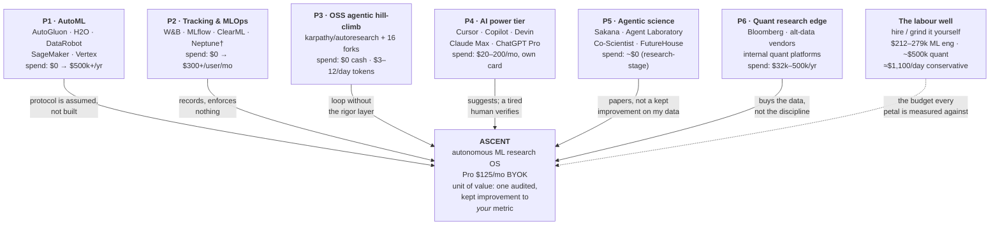

# Petal diagram — Ascent (Blank): the adjacent markets we draw customers from

> **What this is** — Blank's petal: Ascent at the centre, the six adjacent markets whose customers it must pull, their incumbents, and what those customers already spend.
> **Why it exists** — Ascent declared a new market ([market_type.md](market_type.md)), so it has no budget line of its own. Every year-1 dollar comes from a budget spent elsewhere; unnamed, we are asking people to invent one — the standard way a new-market company runs out of money while being right.
> **How to read it** — §3's petal table, then §4, where the beachhead turns out to be an overlap rather than a petal. Attack §5: the petals whose customers have no budget.
> **Depends on / feeds** — inherits [../research/competitors.md](../research/competitors.md), [market_type.md](market_type.md), [market_sizing.md](market_sizing.md); feeds [channel_plan.md](channel_plan.md), [sales_roadmap.md](sales_roadmap.md).

---

## 1. This is not the 2×2, and it answers a different question

[positioning.md §2](positioning.md) places every competitor on two axes (run terminus × output trust) and finds Ascent alone in the *sustained-campaign × audit-gated* quadrant. That is a **differentiation** map: it answers "why are we not them?"

A petal diagram answers a harder and more commercially urgent question: **"whose budget are we taking, and what are those people doing on the day before they switch?"** A company can own an empty quadrant and still starve, because empty quadrants have no incumbent spend in them. The quadrant tells us we are not substitutable; the petals tell us we are fundable.

Blank's rule applies literally here: a market with no customers in it is not a market. So the petals below are drawn around **where Ascent's users are today**, not around where Ascent's category sits.

---

## 2. The map

† Neptune's standalone SaaS shut down March 2026 after acquisition [A33] — the petal is consolidating, which is why its customers are in motion.

---

## 3. The petals

| # | Adjacent market | Who is in it (incumbents) | What those customers spend **today** | Why they would cross to Ascent | What they will not give up | Persona | Crossing cost for us |
|---|---|---|---|---|---|---|---|
| **P1** | **Classical / enterprise AutoML** | AutoGluon (free, AutoML-Benchmark-2025 leader [A23]); H2O Driverless AI ($12k → $1M+/yr contracts; mid-market $250–550k/yr [A26]); DataRobot ($150k–500k+/yr, 850+ enterprises, $285M ARR [A27]); SageMaker Autopilot/Canvas ($1.90/hr workspace, ~$2–7 per small tabular build [A28]); Vertex AutoML (usage-based; Text and Video lines shut down 2025 [A29]) | Free at the individual end; **$150k–550k/yr** at the enterprise end. ~4,000 orgs pay six figures for ML platforms (assumption: deduplicated union, [market_sizing.md §1](market_sizing.md)) | AutoML optimizes *inside* a search space on an evaluation protocol the user must already have correct — it cannot diagnose why recall is bad on new merchants, read a paper about it, or verify the split [A23]. The PoC beat AutoGluon and H2O on the fraud benchmark (founder-reported, reproducible from the repo, not independently verified) | The free strong baseline. AutoGluon is not displaced; it becomes Ascent's opening champion. Enterprise buyers will not give up procurement-shaped vendors — which is exactly why this petal is year-2+ | Jae (card 3); David (card 5, year-2+) | **Low for individuals, high for enterprises.** The category is shrinking, not waiting: 92% valuation haircut at DataRobot, two Vertex product lines killed [A27][A29] |
| **P2** | **Experiment tracking & MLOps** | Weights & Biases ($50–150/user/mo; enterprise ~$300+/unit; 1,400+ paying orgs; acquired for $1.4–1.7B, closed 2025-05-05 [A31][C34][A30]); MLflow (free, 30M+ downloads/mo, 5k+ orgs [A32]); ClearML Pro ($15/user/mo [A34]); Neptune (SaaS dead March 2026 [A33]) | **$15–300/user/mo**, already a line item and already approved. Real-money datum: ~$1.2M per customer-org implied by the W&B acquisition [C34] | A tracker records a leaky split exactly as cleanly as a sound one — it proves nothing about the experiment it logs. Ascent's bundle is the artifact a model-risk reviewer can act on; the tracker's dashboard is not | Their existing logs and integrations. Ascent does not replace the tracker in year 1 and should not try to; it writes the evidence the tracker was never designed to produce | Jae (card 3), Elena (card 4) | **Medium.** The budget is small per seat but pre-approved, and the petal is actively consolidating — buyers here are already re-evaluating |
| **P3** | **OSS agentic hill-climbing** | karpathy/autoresearch — 94,800 stars, 13,400 forks in ~6 months, maintainerless since 2026-03-26, 52 open issues, ~185 issues+PRs [A1][C35]; its 16 curated forks (14 platform ports, ~1 domain extension, **0 rigor additions** [A2]) | **$0 cash.** If they actually run the loop: $3–12/day of mid-tier tokens on their own key [B18][B22] — i.e. $90–360/mo already leaving their wallet, unbudgeted | They already believe in the loop; they filed 185 issues into a repo with nobody home. What they lack is the layer none of the 16 forks built. Zero switching cost — it is the same shape of tool, upstream-credited | Free, local, and hackable. Any Ascent motion that makes the core less free or less local loses this petal outright — hence the constitution ships open (A11) | Marcus (card 2), Priya (card 1) | **Lowest of any petal, and the reason it is the launch channel.** But see §5: this petal's cash spend is $0 |
| **P4** | **AI power-tier subscriptions & coding agents** | Cursor ($20/mo individual, ~$40/user/mo team; ~$2B ARR reports [C17][A36]); GitHub Copilot ($10–39/mo, usage credits from Jun 2026 [C22]); Devin ($20–200/mo + ACU usage; $80/user/mo team [C21]); Claude Max and ChatGPT Pro ($20 → $100 → $200/mo [C23]) | **$20–200/mo on a personal or personally-expensed card** — the single most important number in this file, because it is the wallet Ascent's $125/mo Pro is priced into ([../financials/pricing.md §2](../financials/pricing.md)) | These tools suggest; a tired human verifies. The dominant workaround is "manual + ChatGPT" — 1–3 hand-run experiments a day, no enforced protocol, uncited suggestions, unpoliced self-deception ([../research/competitors.md](../research/competitors.md) row 19) | The chat interface and general-purpose usefulness. Ascent is additive to this petal, never a replacement — nobody cancels Claude to buy Ascent | Marcus, Jae | **Low.** No procurement, no security review at this price point, and the payment behaviour is already normalized [C23][C17] |
| **P5** | **Agentic science / paper factories** | Sakana AI Scientist v1/v2 (~$15–25/paper; company monetizes Japan-focused models, $135M Series B at $2.65B post [A12][A15]); Agent Laboratory / AgentRxiv ($2.33/paper, free OSS [A17][A18]); Google AI Co-Scientist (trusted tester [A19]); FutureHouse / Edison ($70M seed [A20]); Zochi, Carl [A21][A22] | **~$0 from practitioners.** These are research artifacts and trusted-tester programs; the per-artifact cost is $2.33–25, and none of them charges the practitioner a subscription | Their terminus is a paper on *their* chosen problem, not a kept improvement on the user's metric. Independent evaluation found 42% experiment failure in the most famous one [A16]; CMU found four recurring failure modes across flagship systems [A46] | Category legitimacy and academic standing — which Ascent benefits from rather than competes with. This petal *made* the concept sayable | Priya (card 1), academic-adjacent | **High and low-yield.** Real people, no budget, and their institutional purchasing runs on grants. Treat as credibility and content, not revenue |
| **P6** | **Quant research edge & data budgets** | Bloomberg terminal ($31,980/yr/seat [C24]); alternative-data vendors ($100–250k/yr per dataset [C37]); in-house quant research platforms; fund tech + data infra ($200–500k/yr [C37]) | **$32k–$500k/yr per fund**, on budgets that are outcome-elastic — "no budget limit if it makes money and is uncorrelated" [C38]. ~1,000 quant-focused funds (midpoint of a flagged inference, [C36], [market_sizing.md §1](market_sizing.md)) | This petal buys *information* edge and has no product that buys *methodological* edge. The multiple-testing bookkeeping a deflated Sharpe requires is aspirational even at 40-researcher scale (personas card 4) | Data locality. Alpha does not touch a vendor's cloud — and Ascent's steering currently calls hosted LLM APIs, so prompts and telemetry leave unless routed to an approved endpoint. BYO-endpoint and local-model steering are **[ROADMAP]** (A9) | Elena (card 4) | **Highest.** Not the price — the diligence. A pseudonymous solo founder (A5) fails fund and bank vendor-risk DD today; entity, security documentation and an escrow line are prerequisites ([market_type.md §4](market_type.md)). Year-2+ |

### The labour well (not a petal — the denominator)

Every petal above is a substitute for the same thing: a person doing the work. That budget is **$212k average / $279k median total comp for an ML engineer [A37]** and **~$500k for a typical quant researcher [A38]**, of which 38–45% goes to data preparation [A39] and the residual to 1–3 hand-run experiments a day. The pack's conservative day rate is **$1,100/day** ([../financials/pricing.md §1](../financials/pricing.md)). Pro at $125/mo is roughly **one-tenth of one loaded working day per month**. This is not a petal because nobody has a "hire less" budget to reallocate — but it is the number every petal's ROI is computed against.

---

## 4. The beachhead is not a petal — it is an overlap

The sharpest thing this diagram shows is a mismatch the quadrant map cannot:

- **P3 has the customers and no cash budget.** 94,800 people demonstrated demand for the loop, and the loop is free. Stars prove demand for a free toy, not $1,500/yr of enforced rigor ([market_type.md §3.3](market_type.md)).
- **P4 has the cash budget and no problem awareness.** $20–200/mo already leaves these wallets monthly, on a personal card, with no procurement — but a Cursor subscriber is not, by that fact, someone who grinds a fixed metric.

**Ascent's beachhead is P3 ∩ P4: a person who has already run an agentic hill-climb loop *and* already pays $100–200/mo out of their own pocket for AI tooling.** Marcus and Jae are both defined by exactly that intersection (personas cards 2–3). Every acquisition motion in [gtm.md §3](gtm.md) is a way of finding the overlap, and the recruiting pools for the trust test are drawn from it: autoresearch issue and fork authors (P3), r/quant and QuantConnect/Numerai (P6-adjacent individuals who live in P4), AutoGluon and H2O issue trackers (P1's frustrated free tier).

The corollary is a discipline, not a slogan: **a P3 member who has never paid for a tool is not a lead, and a P4 subscriber who does not grind a metric is not a lead.** Both are the most tempting things to count, because both are large and countable.

---

## 5. Which petals to harvest, in order — and the honest weakness

| Order | Petal | Why now | Kill/downgrade condition |
|---|---|---|---|
| 1 | **P3 ∩ P4** (the overlap) | Zero switching cost, pre-assembled audience, no maintainer competing for it, and the wallet already exists at the price point | E3: corrected actives stuck under ~3,000 at month 6, or paid conversion <0.5% of them → the open-core motion (A2) is wrong ([market_sizing.md §6](market_sizing.md)) |
| 2 | **P1's frustrated free tier** (AutoGluon/H2O individual users) | Reachable by one artifact — the fraud bundle that reruns in one command; the comparison is concrete and already in the PoC | Fraud bundle fails independent reproduction in E1 → the crossing argument for this petal has no evidence behind it |
| 3 | **P2** (tracker users, bottom-up) | Budget is pre-approved and small; the pitch is additive, and the petal is consolidating so buyers are already re-evaluating [A30][A33] | If ≥25% of E1 practitioners say they would need to drop their tracker to adopt, the additive framing is wrong and this petal becomes a displacement fight we should not pick |
| 4 | **P6** (quant funds) | Largest per-customer budget, outcome-elastic [C38], and the audit story is native to it | **Already gated:** year-2+, bottom-up pull only, blocked today on vendor DD (A5) and on BYO-endpoint steering being **[ROADMAP]** (A9) |
| 5 | **P5** (agentic science) | Credibility and content, not revenue | Do not fund an acquisition motion here at all in year 1 |

**The honest weakness of this diagram:** the two petals with the most cash (P1 enterprise, P6) are the two Ascent cannot sell into this year, and the petal with the most people (P3) spends $0 cash. The entire year-1 plan therefore rests on converting P3's people at P4's price — which is precisely the pack's #1 riskiest assumption ([../validation/riskiest_assumptions.md](../validation/riskiest_assumptions.md) row 1) restated in budget terms. The petal diagram does not resolve that risk; it explains why it is the risk.

---

## 6. Recommended next 3

1. **Instrument the overlap, not the petals.** Add one question to the v0 signup and the E4 checkout: "do you already pay for an AI coding or research tool out of your own budget?" It converts P3 ∩ P4 from a thesis into a measured segment, costs one field, and is the denominator every conversion claim in [market_sizing.md §3](market_sizing.md) should be computed against.
2. **Aim the second bundle at P1's free tier, not at P3.** The fraud-vs-AutoGluon comparison is the only crossing argument in this file that is already backed by a PoC result and reruns in one command — and it recruits from a petal whose members have a named incumbent they are unhappy with, which P3's members do not.
3. **Write P6 out of every year-1 number and keep it in the diagram.** Its budget is the largest and its diligence gate is unbuildable this year (A5, A9 **[ROADMAP]**); carrying it in revenue plans is how new-market companies convince themselves they are funded. Keep it visible so the prerequisites — entity, security documentation, escrow — stay funded in [../financials/use_of_funds.md](../financials/use_of_funds.md) block 4.
