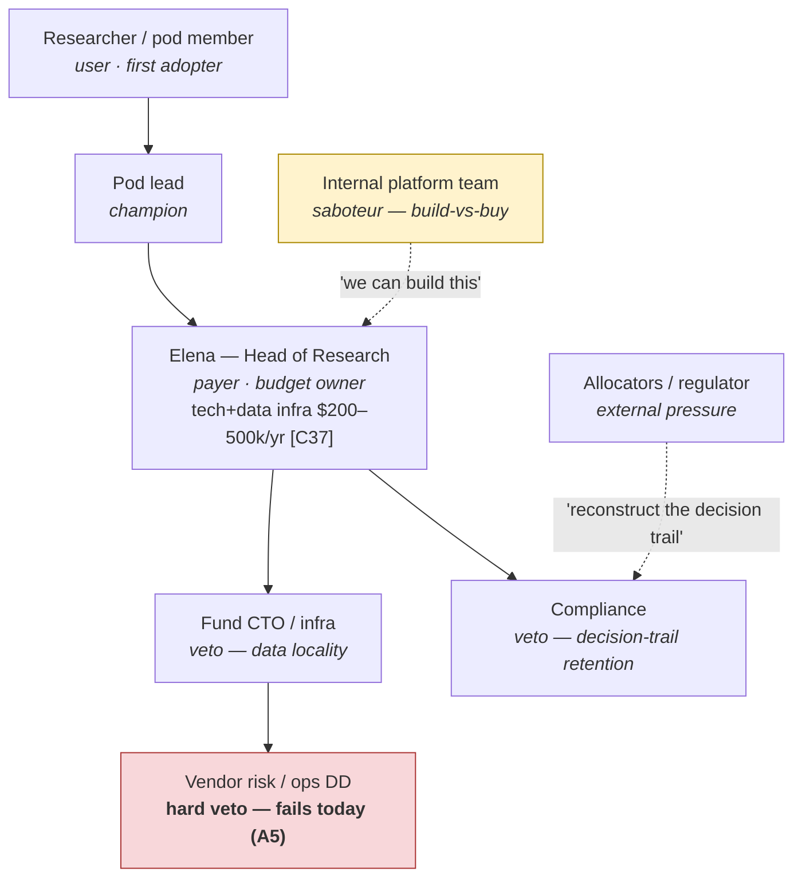

# Sales roadmap — Ascent (organisation map · influence map · access map · sales process)

> **What this is** — Blank's Customer Validation Phase 1 deliverable: who the buying organisation contains, who moves whom, how we reach each node, and the sales process with the artifact each step requires.
> **Why it exists** — "we'll sell to quant researchers and funds" hides that nobody has written down who signs. At the beachhead the answer is one person — a strategic asset; above it it is *no one we can reach*, and an unwritten roadmap lets that stay comfortable until a quarter is spent on it.
> **How to read it** — §2 first (the maps get progressively less flattering), then §5's artifact gates. Attack §4: the access map is where wishful thinking hides.
> **Depends on / feeds** — inherits [personas.md](personas.md), [channel_plan.md](channel_plan.md), [market_type.md](market_type.md); feeds [../validation/decision_making_unit.md](../validation/decision_making_unit.md), [gtm.md](gtm.md).

---

## 1. Division of labour, so nothing is written twice

| Question | Answered in |
|---|---|
| Who is in the buying organisation, who influences them, how do we reach them, what is the sequence of steps? | **this file** |
| What does each *role* want, fear, and require as evidence — and who can veto? | [../validation/decision_making_unit.md](../validation/decision_making_unit.md) |
| What does each channel cost per dollar of list price? | [channel_plan.md](channel_plan.md) |
| What are the funnel metrics and retention levers? | [../validation/get_keep_grow.md](../validation/get_keep_grow.md) |

**The single most important fact about Ascent's sales roadmap:** at the beachhead there is no organisation. Marcus is user, payer, champion and approver simultaneously ([personas.md](personas.md) card 2). Everything below Config B in §2 exists so that we do not accidentally start selling into an organisation before the one-box configuration has been proven to convert.

---

## 2. Organisation maps

### Config A — Marcus: solo quant / two-person prop shop (**the year-1 target**)

| Node | Role | Budget authority | Approval friction |
|---|---|---|---|
| Marcus | user · payer · champion · approver | own capital, own card | **none** — $125/mo is inside the $100–200/mo tier he already buys [C23] |
| (partner, if a 2-person shop) | co-user, informal veto | shared P&L | one conversation |

Sales cycle: not an impulse buy but not an org sale either — adoption is gated by a **reproduce-and-verify cycle of days to weeks** ([market_type.md §4](market_type.md)). Onboarding is designed around the first reproduction, not the first click.

### Config B — Jae: applied-ML engineer inside a mid-size fintech

| Node | Role | Budget authority | Approval friction |
|---|---|---|---|
| Jae | user · champion | corporate card / expense at $125/mo | low — a Slack message; the team already expenses Cursor and Claude [C17][C23] |
| Engineering manager | payer of record | team tool budget | low at $125/mo, real at Team ACV |
| **AppSec / security review** | **veto** | none | **high — this, not price, is the gate.** An autonomous agent near production-adjacent data triggers a review |
| Model-risk reviewer | downstream beneficiary; can become an internal champion | none | — |
| Data platform team | possible saboteur ("we already have MLflow") | owns the tracker | medium |

Mitigation already in the product, not in the pitch: BYOK plus local execution means data and keys stay in Jae's environment (features #8, #19); the pilot runs on public or synthetic data first; the audit trail is itself the security-review artifact.

### Config C — Elena: head of research, ~40-researcher systematic fund (**year-2+, bottom-up only**)

Elena's own framing is the sales script: *"I'm buying the audit trail and the campaign memory, not the hill-climbing — my people can climb hills."* Her stated blocker is data locality, and the honest answer splits in two: training and evaluation data never leave her metal (execution is local by architecture [B26–B28], Pro is BYOK, A12), **but steering currently calls hosted LLM APIs**, so prompts and telemetry do leave unless routed to her approved endpoint. BYO-endpoint and local-model steering are **[ROADMAP]** (A9, feature #49). State the split before she discovers it.

### Config D — David: model risk / CTO, regulated enterprise (**year-2+, no channel today**)

| Node | Role | Reality today |
|---|---|---|
| Internal ML team | user | reachable — as Config B |
| David (model risk / CTO) | payer · approver | reachable only as the internal recipient of a team's winner archives |
| **Vendor risk / procurement / legal** | **hard veto** | **fails immediately.** A pseudonymous solo founder (A5) does not pass vendor DD. Prerequisites: legal entity, security documentation, SOC 2 path, source escrow ([market_type.md §4](market_type.md)), budgeted in [../financials/use_of_funds.md](../financials/use_of_funds.md) block 4 |
| Compliance attestations | requirement | **[ROADMAP]** (A10) — never claimed as shipped |

---

## 3. Influence map — who actually moves each buyer

| Buyer | Moved by | Explicitly **not** moved by | Evidence for this read |
|---|---|---|---|
| **Marcus** (solo quant) | The multiple-testing literature he has already read [D6][D7][D8]; a losing month traced to an overfit backtest; peer consensus on r/quant; **our own self-deflation** — the corrected number published before a critic computes it | Benchmark headlines, testimonials, founder credentials, a raw +6.52 | His stated objection is that a Sharpe selected from 265+ trials is exactly what the DSR discounts ([personas.md](personas.md) card 2). Agreeing out loud is the move |
| **Jae** (applied-ML engineer) | A one-command rerun of the fraud bundle on his own laptop; his model-risk reviewer accepting the audit trail; his security team's verdict | Claims about autonomy or throughput | His two objections are "why a third tool?" and "security won't clear an autonomous agent" — both answered by artifacts, neither by argument |
| **Priya** (domain scientist) | Her PI; a leakage correction or retraction in her subfield; a reproducible bundle from a dataset she recognises | Anything AI-generated presented without a trail — she is inside the 46% who distrust AI output accuracy [C3] | Card 1: "my PI won't accept a black box" |
| **Elena** (head of research) | One of her own pod leads adopting bottom-up (the Cursor path: individual → team → enterprise, 60% of Cursor revenue now enterprise [C17]); an allocator or regulator asking for the decision trail | Cold outreach of any kind | Card 4 trigger is explicitly bottom-up |
| **David** (model risk) | An examiner finding on model documentation; his own team handing him a better development record than his six-figure vendor produces [C19] | Product demos, before vendor DD is passable | Card 5: his first objection is about the vendor, not the product |

**External influencers with real weight** (none of them customers, all of them able to change a buyer's mind):

| Influencer | Weight on whom | Our posture |
|---|---|---|
| Karpathy / the autoresearch project | The entire P3 community — a permission-giver, not an endorser | Private heads-up **before** launch; separate name; prominent upstream credit; a pre-written branch if he returns or blesses another fork ([gtm.md §4](gtm.md)) |
| Bailey & López de Prado (deflated Sharpe, CPCV) [D6][D7][D8] | Marcus and Elena, decisively | Cite in every skeptic conversation; adopt the critique as roadmap (trial-count-corrected acceptance gate, feature #25) |
| Kapoor & Narayanan (leakage across 294 papers, 17 fields) [D5] | Jae, Priya, and every model-risk reviewer | The taxonomy is what the seeded-violation harness injects |
| CMU's four failure modes in flagship AI-scientist systems [A46] | Elena and David — it inverts "autonomy increases my model risk" | Sell the gates, not the autonomy |
| AutoML Benchmark / AutoGluon maintainers [A23] | Jae and P1's frustrated free tier | Never claim AutoGluon is bad; it is the opening champion Ascent must beat honestly |
| r/quant, QuantConnect, Numerai communities | Marcus | Publish, answer, never link-drop — the plan-B channel stands on its own if the fork branch fires |

---

## 4. Access map — how we physically reach each node, and where we cannot

| # | Target node | Path | Warmth | Cost to open | Status today |
|---|---|---|---|---|---|
| 1 | autoresearch issue authors and fork owners | Public GitHub handles; substantive in-thread answers on the top ~15 issues (52 open, ~185 issues+PRs [A1][C35]) | Warm by context — they asked a question nobody answered | ~15 founder-hrs/wk, weeks 1–8 | **OPEN — the primary path** |
| 2 | Karpathy | Private issue/email heads-up before launch | Neutral; a courtesy, not a lead source | One message | **PENDING — must happen before day 1** ([gtm.md §4](gtm.md)) |
| 3 | r/quant · QuantConnect · Numerai forums | Publish the DSR-honest bundle and the methodology write-up; participate, never link-drop | Cold but topical | Founder time; reputational risk if promotional | **OPEN — the plan-B channel** |
| 4 | AutoGluon / H2O issue trackers (P1's frustrated free tier) | Answer real questions; the fraud bundle is the artifact | Cold, topical | Low | **OPEN** |
| 5 | Founder's own network | Direct | Warm | Free | **OPEN — 10 of the ~40 trust-test candidates** |
| 6 | Jae's engineering manager | **Through Jae only.** No direct motion | — | — | **Bottom-up only, by design** |
| 7 | Jae's AppSec reviewer | Through Jae, with the audit trail as the review artifact | — | Product work, not sales work | Reachable, but as a *document* not a meeting |
| 8 | Elena (head of research) | Through a researcher already running Ascent | — | Requires a fund-employed user first | **NO DIRECT ACCESS.** Allocator and conference networks are not available to a pseudonymous founder |
| 9 | Fund CTO / vendor risk | Through Elena | — | Blocked pre-entity | **NO ACCESS (A5)** |
| 10 | David (model risk, regulated enterprise) | Through an internal team's winner archives | — | Blocked pre-entity and pre-attestation | **NO ACCESS (A5, A10 [ROADMAP])** |

Rows 8–10 are the honest content of this file. Three of the ten nodes — and the three holding the largest budgets in [petal_diagram.md §3](petal_diagram.md) — have **no access path that exists today**, and the blocker is corporate identity, not product. That is why [../financials/revenue_build.md](../financials/revenue_build.md) carries no enterprise revenue in year 1 and why [channel_plan.md](channel_plan.md) closes C10 until year 2.

---

## 5. The sales process, with the artifact each step requires

Feature numbers refer to [../product/features_prioritized.md](../product/features_prioritized.md). "Kernel" = trust-test kernel, features #1–9, the E1 critical path.

| Step | What happens | **Artifact required** | Exists? | Exit criterion |
|---|---|---|---|---|
| **0 · Standing** | We earn the right to be in the community before asking for anything: top ~15 issues answered in-thread, bridge write-up published, upstream credited | The bridge write-up ("what 16 notable forks built, and the layer none of them did" [A2]); the answered threads themselves | To write | E5: substantive engagement on ≥10 of ~15 threads **and** ≥500 successor-repo clones in 30 days |
| **1 · Self-qualification** | A stranger reads a published champion bundle and decides whether it is worth an hour | **Winner archive** (#5, PoC✓) + **offline DSR output** (#7): "+6.52 raw, X deflated over N trials, ledger attached" | #5 PoC✓; #7 kernel work | They clone |
| **2 · Verification** | They rerun our result on their machine, unaided | **`ascent reproduce`** (#3) with the epsilon-band tolerance policy — metrics within pre-declared bands plus config/data fingerprint equality, **not** bitwise equality | Kernel work | Reproduction succeeds; the opt-in registry ping (#9) records it. **E1 leg (a): ≥5/15** |
| **3 · Skeptic gate** | The hard question arrives: "how do I know the gates work?" | **Gate scorecard** from the seeded-violation harness (#4): per-gate catch and false-positive rates on ≥50 seeded violations per gate class, scoped to deterministic classes | Kernel work; **E6 must pass before E1 sessions run** | They ask "can it do this on *my* data?" |
| **4 · Own-data trial** | The contamination-proof act: their private dataset, their key | **BYOK minimal path** (#8) + **split-verification stamp** (#6) + contamination advisory (#21, launch tranche) | #8/#6 kernel; #21 launch | **Activation** — first own-data campaign that survives the gates. **E1 leg (b): ≥3/15** |
| **5 · Commitment** | They put money down | Pricing page; the **"what is free / what is paid" sheet** ([channel_plan.md §5](channel_plan.md)); Stripe checkout | To write | **E4: ≥30 pre-orders + ≥5 design partners** by ~day 120 |
| **6 · Habit** | The loop that makes them stay: overnight run → morning dashboard → steer → rerun | **Campaign dashboard** (#10) + **stall detector with suggested steering** (#17) | Launch tranche | ≥1 campaign/week in weeks 2–4 post-activation ([../validation/get_keep_grow.md](../validation/get_keep_grow.md)) |
| **7 · Team trigger** | A second person needs to see the archives | **Shared winner-archive search** (#44) + parallel campaigns (#43) + org ledger | LATER — gated on beachhead traction | A shared-archive request, or a second seat |
| **8 · Fund / enterprise** | Year-2+ only | **Data-flow disclosure one-pager** (steering calls hosted APIs today); **family-level deflated thresholds** (#45); **attestation & model-risk export** (#48) — **[ROADMAP]**; vendor-DD pack: entity, security documentation, escrow | Disclosure page: write now. #45/#48: **[ROADMAP]** | Not opened until the DD pack exists |

**Sequencing that is binding, not advisory:** steps 1–3 must be complete before step 4 is offered, and E6 (step 3's artifact) must pass before the E1 sessions that exercise step 2 — because the toughest objection in the room will be "show me the gates catching a planted leak," and answering it with an unmeasured gate is the one unrecoverable error with Marcus.

---

## 6. Disqualification and stall rules (declared 2026-08-29)

| Situation | Rule |
|---|---|
| First question is "can you complete our vendor questionnaire?" | **Disqualify for now, honestly and immediately.** No entity, no security documentation. Offer the free core and a revisit date; do not start a process we cannot finish |
| Wants a hosted run on data that cannot leave their environment | **Disqualify.** BYO-endpoint steering is **[ROADMAP]** (#49). Local execution is real; hosted steering is not local. Say the split |
| Asks for compliance attestations | **Never claim shipped** (A10). They are **[ROADMAP]**; the honest offer is the winner archive as a development record |
| "We already have MLflow / W&B" | Additive framing: Ascent writes the evidence a tracker was never designed to produce. **If they insist on displacement, walk** — that is a fight [channel_plan.md](channel_plan.md) does not fund and [petal_diagram.md §5](petal_diagram.md) explicitly declines |
| A prospect wants the headline number without the deflation | **This is our stall, not theirs.** Publish raw and deflated together, always. One overclaim to a persona-2 buyer is unrecoverable ([positioning.md §4](positioning.md)) |
| Enterprise inbound arrives before year 2 | Log it, answer honestly, do not chase. Inbound pull is the only enterprise motion, and even that waits on the DD pack |

---

## 7. Recommended next 3

1. **Execute step 0 before anything else in this file exists.** Karpathy gets the private heads-up, then the top ~15 issues get substantive in-thread answers and the bridge write-up ships. Every access path in §4 that is currently OPEN runs through community standing we have not yet earned, and the repo has been maintainerless since 2026-03-26 — the window is a competitive asset that decays weekly.
2. **Build the step-3 artifact before the step-2 conversations happen.** The gate scorecard (#4/E6, ≥50 seeded violations per gate class) is the only artifact that converts the hardest objection into the demo, and the sequencing rule in §5 makes it a hard prerequisite for the E1 sessions in weeks 10–13.
3. **Write the step-8 data-flow disclosure one-pager now, while nobody is asking for it.** It costs an afternoon, it is the honest answer to Elena's only stated blocker, and a disclosure written before a deal is credibility — the same words written during a deal read as a concession.
