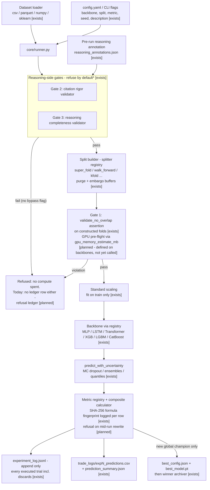

# D01 — Experiment Data Pipeline

From raw dataset to append-only evidence, as implemented in `core/runner.py` (one experiment per invocation). Gate order matches the code: the reasoning-side gates run before any data work; the split-overlap assertion runs after split construction, before training.

**What a reviewer should notice:** (1) the reasoning gates sit before any data work and refuse by default — the asterisk in the diagram: the one documented bypass, `--bypass-reasoning-gate`, does not skip silently — the runner inserts `TODO-REWRITE` sentinels, tags the entry `_needs_rewrite`, and the dashboard surfaces it red; (2) Gate 1's overlap assertion necessarily runs *after* the splitter constructs folds — it validates the actual fold geometry, not the config's intent — and the GPU pre-flight is honestly marked planned wiring (the estimator exists on every backbone; the runner doesn't call it yet); (3) the executed-trial ledger is append-only and records discards — the raw material for the trial-count-corrected acceptance gate (deep_dives §4) and the private corpus (A11) — but a *refused* experiment currently leaves no ledger row at all, which destroys exactly the data the calibration corpus needs; the refusal ledger (one JSONL) is on the this-quarter list; (4) the composite fingerprint is logged on every row today (tamper-evident); comparing and refusing on mismatch is the planned 15-line patch (`not_vaporware.md` §5); (5) champion artifacts are written by exactly one code path, so "champion" has a single, auditable definition.
