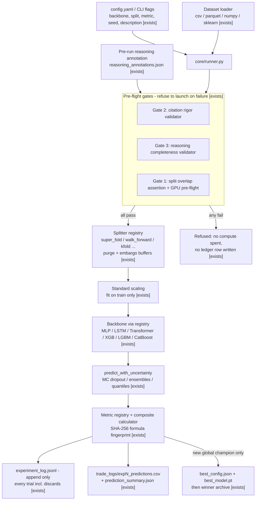

# D01 — Experiment Data Pipeline

From raw dataset to append-only evidence, as implemented in `core/runner.py` (one experiment per invocation).

**What a reviewer should notice:** (1) the gates sit *before* the splitter — an experiment that fails citation or reasoning validation costs a refusal message, not compute, and never appears in the ledger as a "run"; (2) the ledger is append-only and records discards, which is the raw material for the trial-count-corrected acceptance gate (deep_dives §4) and the private corpus (A11); (3) scaling is fit on train only — the leakage discipline extends below the split level; (4) champion artifacts are written by exactly one code path, so "champion" has a single, auditable definition.
