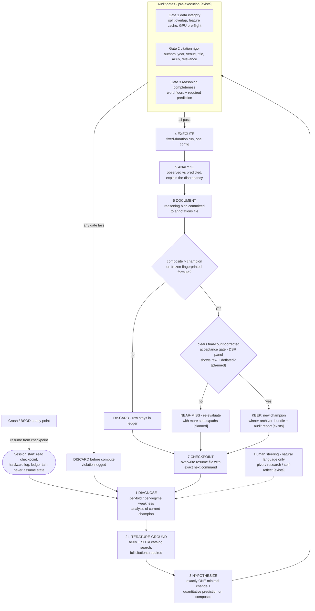

# D02 — The 7-Step Closed Loop with Audit Gates

> **What this is** — The constitution's 7-step scientific method drawn as a re-entrant control loop with its two gate points and crash path.
> **Why it exists** — It shows validity checked before compute is spent and improvement checked before commit against a fingerprinted formula — so neither an invalid nor a non-improving change reaches the champion line. The planned deflation diamond marks where the multiple-testing critique becomes an enforced threshold.
> **How to read it** — The two decision diamonds after step 6. Attack the [planned] tags on the deflation and NEAR-MISS paths; the keep comparison is tamper-evident only.
> **Depends on / feeds** — Listed in [00_INDEX.md](00_INDEX.md); each turn expands into [D01.md](D01.md); branch policy in [decision_tree.md](../techniques/decision_tree.md).

The constitution's scientific method (sections 23–29) as a control loop. Everything here exists in the PoC; the trial-count-corrected threshold is the one planned addition, marked.

**What a reviewer should notice:** (1) the loop has *two* gate points — validity is checked before compute (gates) and improvement is checked before commit (fingerprinted composite), so neither an invalid nor a non-improving change can enter the champion line; (2) the keep decision compares against a cryptographically fingerprinted formula the agent cannot rewrite *undetectably* — every ledger row logs the fingerprint, so a mid-run rewrite is permanently visible; automatic refusal on mismatch is planned (deep_dives §1); (3) the planned deflation diamond is where the multiple-testing critique (survey §6, [D6][D7]) becomes an enforced threshold rather than a caveat; (4) human steering enters at exactly one point, as data, and the crash path re-enters at session start — the loop is re-entrant by construction.
