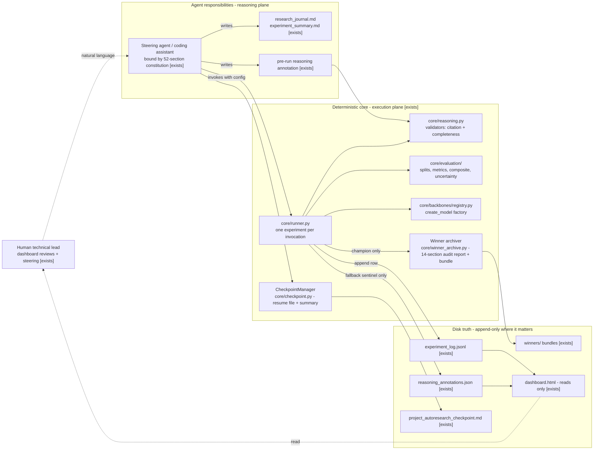

# D03 — Component Orchestration and the Ownership Contract

Who calls whom, and — the part that matters forensically — who is allowed to write which file. From repo `ARCHITECTURE.md` ("Dashboard Files Update Mandate").

**What a reviewer should notice:** (1) the reasoning plane (LLM) and the execution plane (deterministic Python) are separated, and the *execution plane owns the ledger* — the agent may not, **by contract**, write a result row; it invokes the runner, which writes what actually happened. Stated honestly: the JSONL has no OS-level ACL, so this is an ownership *contract* with a tamper-evidence backstop (per-row fingerprints, git history, append-only diffing), not technical prevention — hard enforcement is a sandbox property [D32], roadmap; (2) the runner's only write into the reasoning file is a `TODO-REWRITE` sentinel — it never fabricates reasoning; (3) the dashboard is read-only over disk truth, so what the human monitors is what the runner wrote, not what the agent claims; (4) this ownership split is why "the agent audited itself" is not the trust model — the deterministic core audits the agent, and violations of the contract are designed to be loud rather than impossible.
