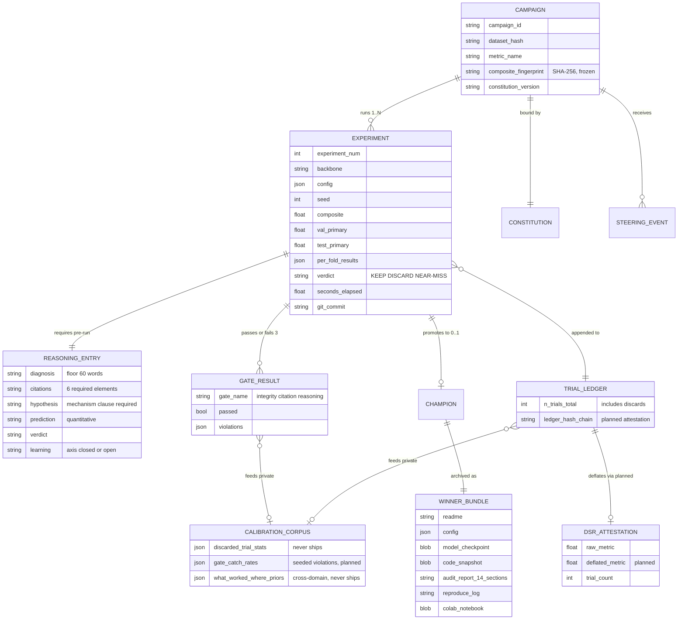

# D04 — Durable Run Record & Calibration-Corpus Schema

The data model that makes a campaign auditable — and the A11 boundary: what ships in public bundles vs what accumulates privately as the moat.

**What a reviewer should notice:** (1) every entity except two exists in the PoC today as concrete files (`experiment_log.jsonl`, `reasoning_annotations.json`, `winners/`, checkpoint markdown) — the planned entities are exactly the DSR attestation and the calibration corpus aggregates; (2) the **A11 boundary**: WINNER_BUNDLE ships publicly (champions + run logs + audit reports); TRIAL_LEDGER discard statistics, gate catch-rates, and what-worked-where priors never ship — bundles carry the positive result and its evidence, the corpus keeps the negative space a fork cannot backfill; (3) the ledger's planned hash chain makes *omitting* a discarded trial detectable — the property a trustworthy deflated Sharpe requires; (4) the composite fingerprint lives at campaign scope: one frozen formula per campaign, by construction.
