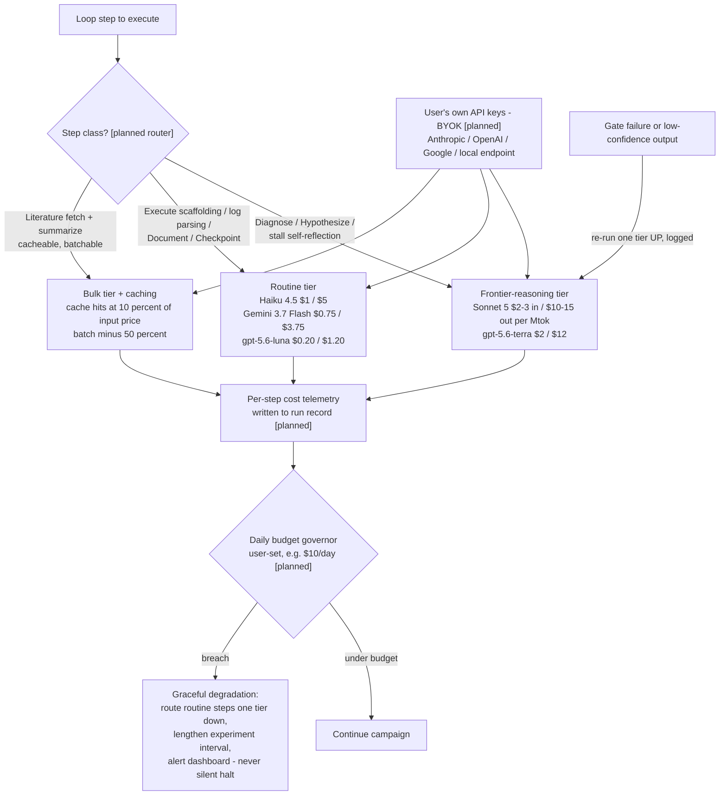

# D05 — Model Routing & Cost Control (BYOK)

The product's token economics (A12: BYOK-first; tokens are user-side). The PoC ran a single Claude-family assistant; the routing layer is the productization, priced at real Aug 2026 list prices [B18][B19][B20].

**What a reviewer should notice:** (1) the split is by *step class*, and the frontier slice is deliberately thin — the arithmetic that makes a 24/7 campaign $3–12/day mid-tier-routed vs $20–60/day all-frontier (capability_table §3) is this diagram; (2) escalation runs upward on failure and is logged, so cheap-model errors cost one retry, not silent quality loss; (3) BYOK means Ascent's Pro margin carries zero token COGS by construction (A12) and the user's spend rides the 40–50x/yr capability-cost decline [B16] while frontier list prices rise [B19][B21]; (4) the constitution is what makes models swappable (A9) — behavior is pinned by the protocol file, not by one vendor's prompt quirks.
