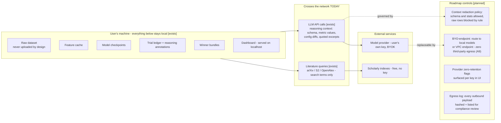

# D06 — Security, Privacy & Data Boundaries

What stays on the user's machine, what crosses the network today, and the BYO-endpoint roadmap (A9). Honesty first: in the PoC, reasoning context — which can include feature names, metric values, and data excerpts the agent chooses to quote — goes to the LLM API. That is the boundary to engineer, not to deny.

**What a reviewer should notice:** (1) the dataset, models, ledger, and bundles are local by architecture — there is no Ascent cloud in the data path, which is the compliance story for funds and hospitals (edge-high, A10 framing: roadmap attestations, not shipped certifications); (2) the honest hole is named on the diagram: reasoning tokens can quote data, so the redaction policy and the egress log are the real security deliverables, not a "we never see your data" slogan — with BYOK, *Ascent* never sees the tokens either, only the model provider does; (3) BYO-endpoint (local 90B-class models are laptop-feasible in 2026 [B26]) closes the loop entirely for the paranoid tier; (4) 128 GB unified-memory laptops make "fully air-gapped campaign" a hardware SKU away, not a fantasy.
