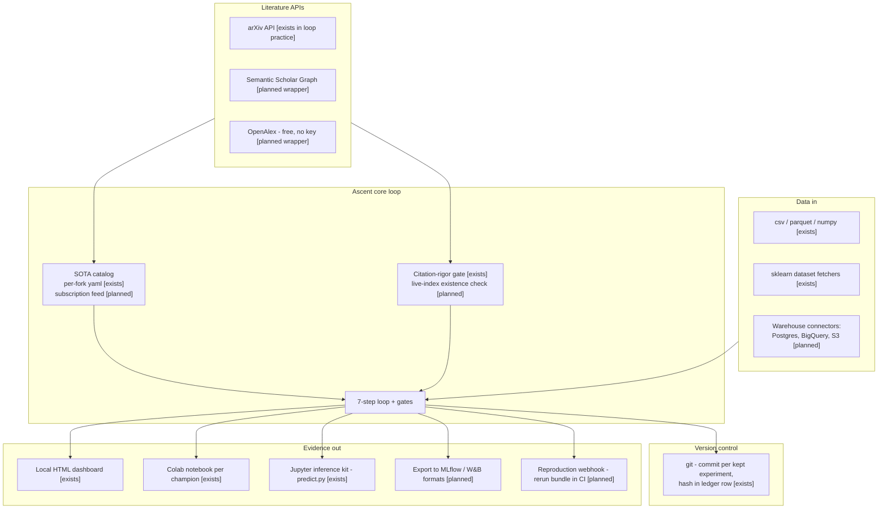

# D07 — Integrations & Ecosystem

What the loop plugs into. Retrieval is commodity infrastructure [B24][B25]; the value is enforced correct use (Gate 2), not the API calls.

**What a reviewer should notice:** (1) the integration surface is deliberately asymmetric — thin on the way in (files and fetchers; a laptop tool must not require a data platform), rich on the way out (every champion exports a runnable bundle: Colab notebook, predict.py, reproduce log — the evidence formats skeptics already trust); (2) git is not decoration: one commit per kept experiment with the hash in the ledger row is what makes the champion lineage independently checkable; (3) exporting *to* MLflow/W&B positions trackers as consumers of Ascent's records, not competitors (landscape Tier 5: trackers record what humans chose to run — Ascent generates the record); (4) the scholarly APIs are free and stable — no integration moat is claimed there, per capability_table §4.
