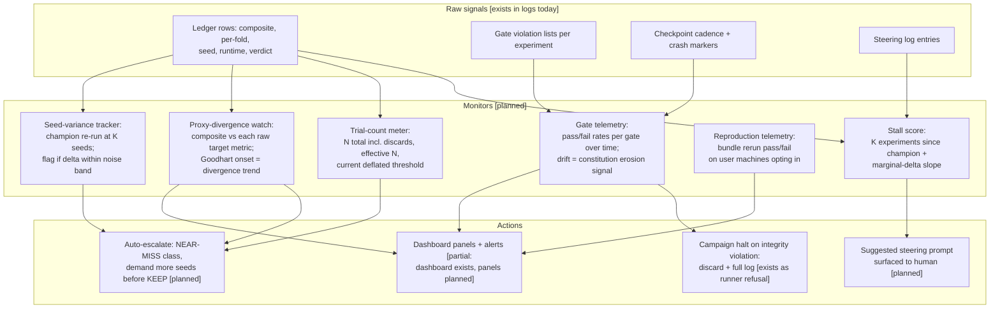

# D08 — Observability, Evaluation & Safety Monitoring

What the system watches about itself. The raw signals all exist in today's logs; the monitors that consume them are the productization. This diagram is the answer to "who audits the auditor."

**What a reviewer should notice:** (1) M3 is the direct answer to the strongest theoretical critique — Goodhart's threshold effect [D31]: fingerprinting froze the proxy, this monitor watches whether the frozen proxy is drifting from the raw targets it summarizes; (2) M2 and M4 operationalize the two statistical exposures the survey names (seed-luck accumulation [D11][D12], max-of-N selection [D6][D7]) as running gauges, not one-time caveats; (3) M5 is the trust flywheel instrumented: every opted-in bundle rerun is third-party reproduction telemetry — the metric the whole company's riskiest assumption hangs on; (4) no monitor here requires new data collection — the PoC's ledger already carries every input field, which is why this layer is buildable this quarter (not_vaporware.md).
