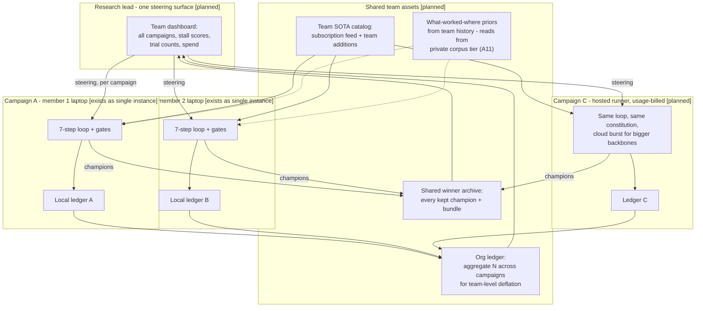

# D09 — Team & Multi-Campaign Scale-Out

The Team tier (A2/A12): N campaigns, shared knowledge, one steering surface. Everything below the single-campaign boxes is planned — the PoC is single-campaign by design, and its six domain forks were run serially by one founder. This diagram is the honest extension, not a claim of current capability.

**What a reviewer should notice:** (1) scale-out is *federation of laptops*, not a cluster — each campaign keeps its data and ledger local (D06 boundary preserved), and only champions, ledger aggregates, and steering cross machines; (2) the org ledger is the subtle but load-bearing piece: multiple-testing inflation compounds *across* a team's campaigns on the same dataset, so team-level deflation needs the aggregate N — a correctness feature no tracker offers and a natural paid-tier boundary; (3) the hosted runner (usage-billed, Devin-ACU precedent [C21]) is the only cloud component, and it runs the identical constitution — no rigor fork between local and hosted; (4) AgentRxiv's measured 13.7% gain from shared validated results [D17] is the evidence anchor for the shared winner archive being worth its complexity.
