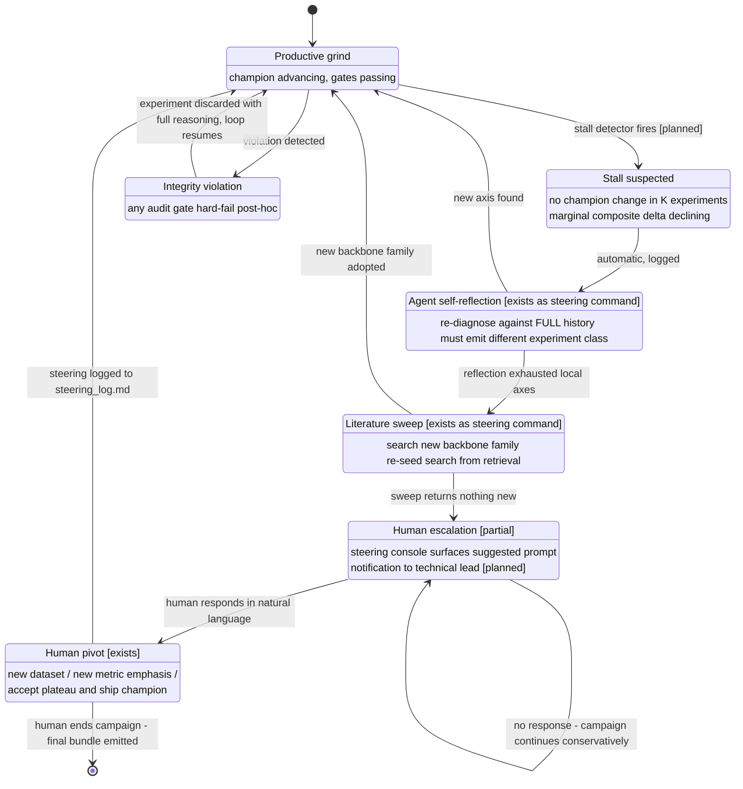

# D10 — Human-in-the-Loop Steering & Escalation

The stall → self-reflect → pivot ladder (constitution §49–52). The protocol and steering log exist; the detector and notification surface are productization. This is the diagram of "minimum steering bandwidth" — the open question the literature hasn't measured (survey §6) that Ascent's steering log turns into a metric.

**What a reviewer should notice:** (1) escalation is a *ladder*, and the two cheap rungs (self-reflect, literature sweep) run without the human — the founder-reported ablation says high-level steering beat low-level intervention, and low-level human edits actively slowed convergence (paper C.2, single-seed; RE-bench's division of labor independently agrees [B4]); (2) integrity violations bypass the ladder entirely — discard is unconditional and logged, never negotiated with the human; (3) the no-response self-loop at Escalate encodes the honest limit the paper concedes: a human must eventually notice — the system's job is to make noticing cheap (one dashboard glance) and to keep grinding conservatively meanwhile; (4) every transition writes to the steering log, which is both the audit trail and the demo (BRIEF: the steering log is the proof that technical-lead-level humans can run research factories).
