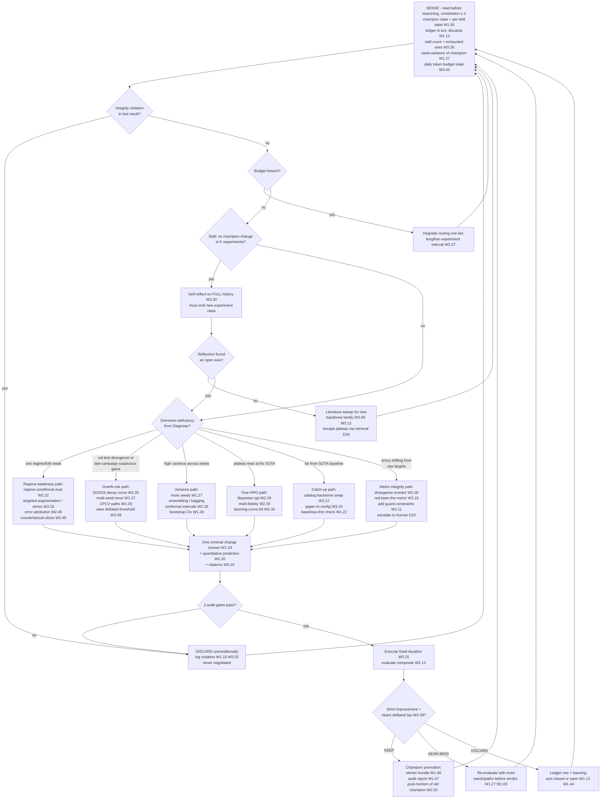

# Technique Decision Tree — How the Agent Picks the Next Experiment

The triage the constitution runs at the top of every cycle: sense state → priority gates → branch on the dominant deficiency → re-evaluate after every experiment. Technique IDs resolve in `wave1.md`–`wave3.md`. Status: the sensing inputs and priority gates exist in the PoC (ledger, gates, checkpoint); the branch logic exists as constitution prose executed by the agent — the productization is making it explicit, logged policy [planned].

## The tree

## Logic table

| Priority | Condition (sensed from) | Action | Techniques fired | Exit |
|---|---|---|---|---|
| 0 — safety | Gate violation flag (runner refusal or post-hoc detection) | Unconditional discard, full log; never bypassed by any downstream logic | W1.10, W3.02 | back to SENSE |
| 1 — budget | Daily token spend > user cap (cost telemetry) | Degrade routing tier, lengthen intervals; alert, never silently halt | W3.37, W3.45 | back to SENSE |
| 2 — stall | No champion change in K experiments AND marginal delta declining (ledger tail) | Self-reflect over full history; if axes exhausted → literature sweep; if sweep empty → escalate to human (D10 ladder) | W3.30, W3.09, W3.12 | new axis or human |
| 3a — regime weakness | One fold/regime ≥ X% below mean (per-fold table) | Targeted augmentation, stress scenarios, error attribution on that slice | W2.22, W2.25, W2.46, W2.48 | one gated experiment |
| 3b — overfit risk | val−test gap widening across ledger OR suspicious late-campaign gains | Decay-curve check, multi-seed rerun, CPCV, raise acceptance bar | W2.20, W1.27, W1.03, W2.08 | verdict revision |
| 3c — high variance | Champion delta within seed-noise band (seed-variance tracker) | Seeds/ensembling/conformal before any new search | W1.27, W1.28, W2.26 | tighter estimate |
| 3d — near-SOTA plateau | Champion within ~1σ of catalog SOTA (catalog compare) | Fine HPO: BO + multi-fidelity + curve-kill | W2.29, W2.30, W2.34 | marginal gains or stall |
| 3e — far from SOTA | Champion ≪ catalog baseline | Backbone swap from catalog, paper-faithful config, re-verify baseline | W3.12, W3.15, W1.22 | step change |
| 3f — metric integrity | Composite–raw divergence trend (monitor M3) | Red-team metric, add guard constraints, escalate — this branch outranks all 3a–3e when it fires | W2.09, W2.15, W2.11 | human decision |
| 4 — re-evaluate | Always, after every experiment | Ledger append, checkpoint refresh, verdict-conditional archive | W1.13, W1.42–W1.50 | back to SENSE |

**What a reviewer should notice:** (1) safety and metric-integrity branches structurally outrank progress branches — the tree cannot trade rigor for gains; (2) every branch terminates in the same gate + fixed-duration + verdict spine, so no path around the audit machinery exists; (3) the NEAR-MISS verdict is the anti-seed-luck valve: borderline wins buy more evidence, not promotion; (4) the tree is the constitution made executable — today the agent runs it as prose judgment, and productization means logging which branch fired per experiment (one more ledger column, feeding the A11 corpus).
